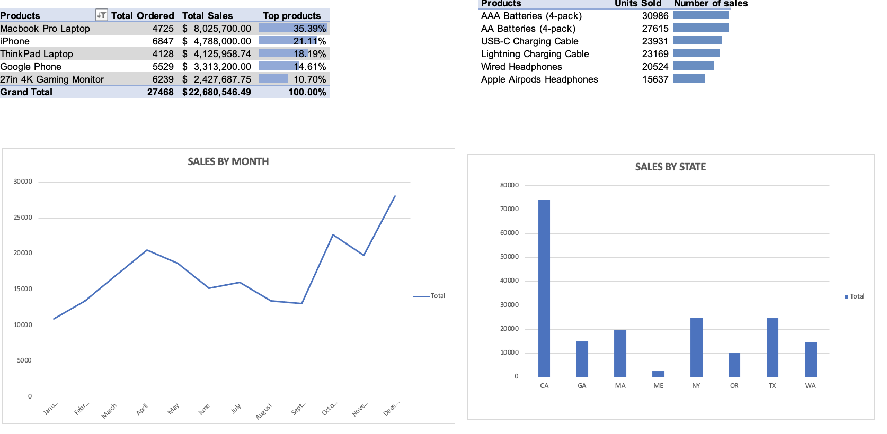

# Sales analysis (Excel)

## Project Overview
- An electronics store needs to increase its profits
- A KPI is found that will allow to increase profits at the lowest cost.
- Sales were evaluated by product, city, time and over time.
- This analysis was done on a database with 180,000+ values using Excel only 
(My laptop was not happy about this :P)

## Objetives:
### Questions that will drive the analysis
- Which product of all the stores generates the highest profits?
- Which months of 2019 will generate the highest profits and on which dates?
- What is the best time to sell our products?

## Cleaning and preparation:
The data shows the sales of an electronics store, you can see the raw data in this **[Link]**
As you can see in the image below, the format of the data was not appropriate for the analysis, so it had to be cleaned and prepared. 

The activities performed were the following:
- Eliminate duplicates and cells that did not correspond to the data.
- Eliminate or correct missing values
- Adjust the dates because they did not have the proper format.
- Created city and state columns for the analysis.

## Data analysis:
Most of this analysis was done using Excel pivot tables and visualizations considering the target questions.

- Which product of all the stores generates the highest profits: For this, the products were analyzed with respect to sales.

- Which months of 2019 will generate the highest profits and on which dates? The sales analysis was made over time

- What states purchase our products the most?

## Vizualitation:
Finally we obtained a dashboard showing the sales in a general way.
You can see the dashboard below 

## Conclutions:
- Despite being the least sold product, the McBook Pro Laptop remains the best selling product every month.
- The best selling months are October and December.
- Sales in California were much higher than in the other states, concentrating marketing efforts here would generate higher profits but it is necessary to analyze the competition and market saturation for a better conclusion.
- It is advisable to focus marketing efforts on the McBook Pro as slightly increasing sales in this product could considerably increase profits.
